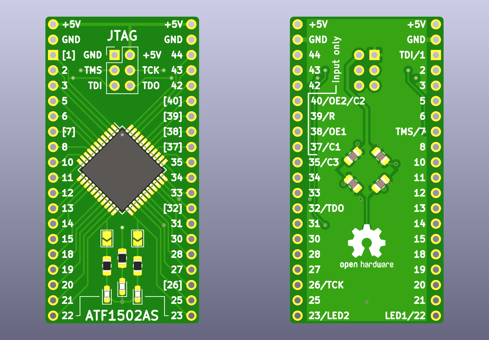
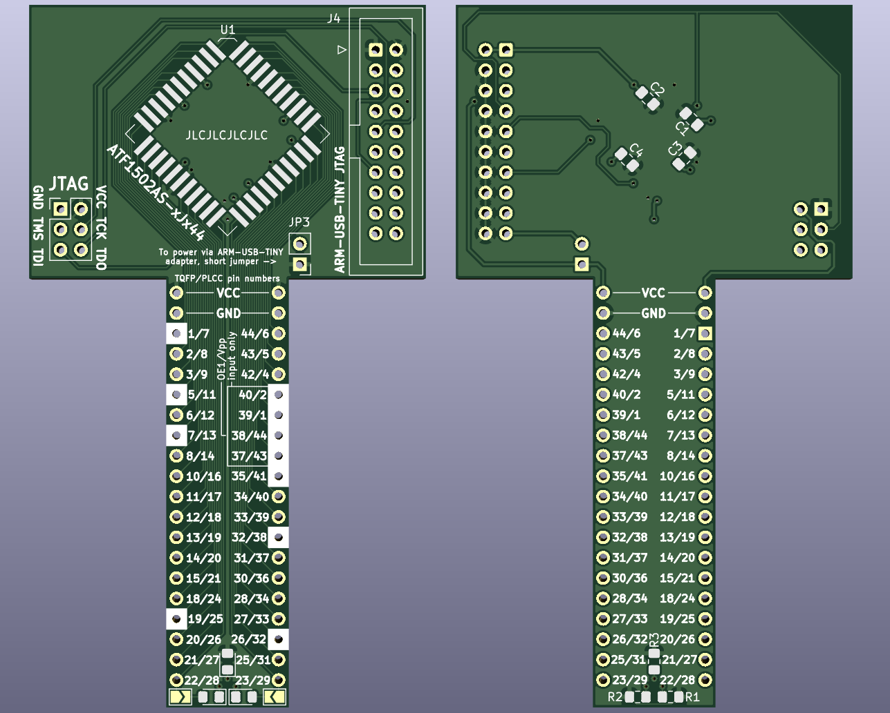

ATF1502-EVB
===========

*ATF1502-EVB* is a simple and low-cost evaluation board for the [Microchip ATF1502AS](https://www.microchip.com/wwwproducts/en/ATF1502AS) CPLD. It may also be used with ATF1504AS in the TQFP-44 package. It breaks out every I/O pin on a DIP-style package, exposes JTAG on a 6-pin connector, and optionally (with a solder jumper) allows two LEDs to be connected to pins 22 and 23 of the CPLD.

[PCBWay](https://www.pcbway.com/) has sponsored a prototype batch of these boards, and I'm very happy with how they turned out.  (Thanks!) See [this Twitter thread](https://twitter.com/whitequark/status/1238286231433330688) for details.

See also [schematics](ATF1502AS-EVB/Fab/ATF1502AS-EVB.pdf).

ATF1502AS-EVB-PLCC44-COBBLER
============================
The *ATF1502AS-EVB-PLCC44-COBBLER* board features the same ATF1502AS CPLD, but the variant that comes in a PLCC44 package.
The style of the board is a 'cobbler', designed to be easily inserted into a breadboard.
It also features a secondary jtag port designed to be compatible with Olimex ARM-USB-TINY adapters.

See also [schematics](ATF1502AS-EVB-PLCC44-COBBLER/Fab/ATF1502AS-EVB.pdf).

License
-------

[CC0](LICENSE-CC0.txt)
